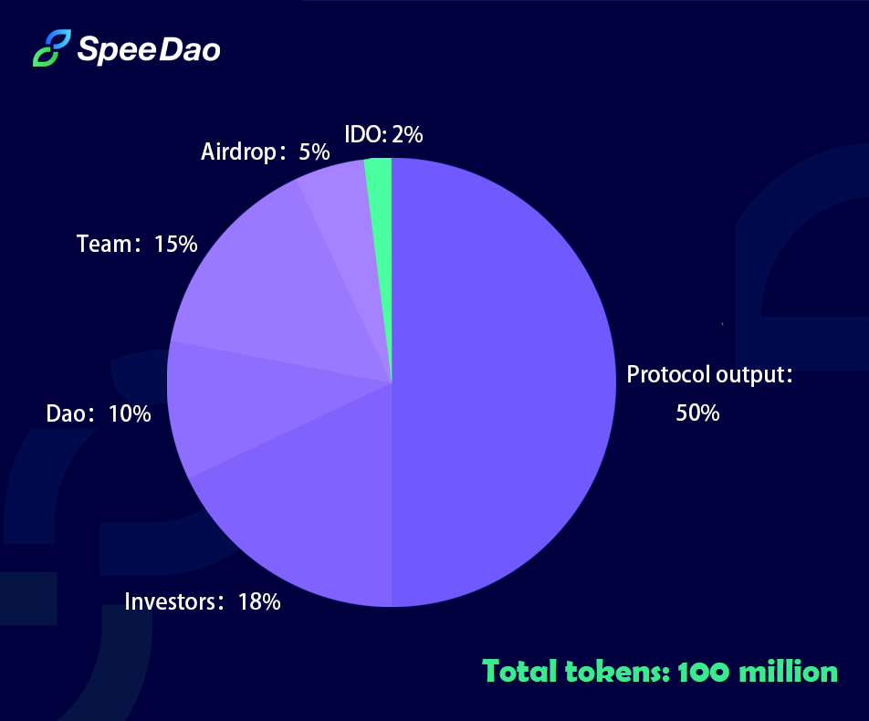

# Economic Model and Governance

The total number of tokens is 100 million, and the contract address

All protocol revenue is distributed to Vetoken holders through market repurchase and redistribution. At the same time, Vetoken holders can initiate proposals and participate in governance.

