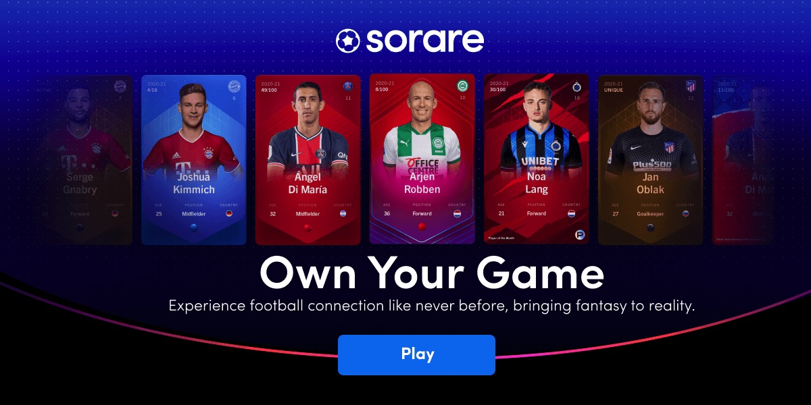

# What are NFTs?

&#x20; Non-fungible tokens (NFTs) have frequently been hitting crypto and mainstream media headlines for over a year. After the international buzz of Beeple's news-worthy $69 million NFT art sale in March 2021, NFTs have begun making a name for themselves. But, what are NFTs? Why do we need non-fungible assets? What makes an NFT valuable? In this article, we'll dive deep into the fundamentals of non-fungible tokens (NFTs). We'll explore various token standards, how to buy NFTs, what makes an NFT valuable, and different NFT use cases.

&#x20; A recent article by The Verge shares its [NFT definition](https://www.theverge.com/22310188/nft-explainer-what-is-blockchain-crypto-art-faq) as: “NFTs are designed to give you something that can’t be copied: ownership of the work”. For artists, musicians, and creatives, this is revolutionary. For people working within the supply chain, retail, hospitality, or medical industries, NFTs offer organization and communication of data and events in a novel and efficient way.&#x20;

### What are Non-Fungible Tokens (NFTs)?

&#x20; Non-fungible tokens (NFTs) offer the ability to tokenize just about anything onto the blockchain. Offering cryptographic security using maths and computer science, NFTs represent unique assets. Further, these assets provide transparent ownership with immutable storage. As such, the owner, price, and any other details of the asset during the time of a transaction will be forever accessible to the public.

&#x20; NFTs are somewhat different compared to cryptocurrencies. Regular crypto coins, tokens, and fiat currency (paper “money”) are _fungible_ assets. This means that a five-dollar bill in my pocket is worth the same as the five-dollar bill in your pocket. Conversely, _non-fungible_ assets represent unique data – such as a piece of artwork, an educational certificate or license, and even social media hashtags!

&#x20; One of the great things about non-fungible tokens is their diverse utility. NFTs present the ability to create a unique representation of any real-life or digital asset and even experiences! Furthermore, as these assets operate using blockchain technology, anyone anywhere can invest in NFTs. However, it is worthwhile to educate yourself about the fundamentals, value, and utility of the NFT before investing in an asset.&#x20;

### What You Need to Know About NFTs

&#x20; Although non-fungible tokens (NFTs) differ from cryptocurrencies, there are a few similarities with investing in a cryptographic asset. For example, some investors have lost their crypto assets forever due to losing the private key (seed phrase or password) to their wallets. Similarly, as your crypto wallet stores your non-fungible assets, you can lose your assets forever if you lose your private key. Further, NFTs can be valuable assets. With blockchain technology, users are like their own bank, responsible for their own security of their investments. Secure storage of private keys to wallets holding NFTs should be the number one priority of every investor.

&#x20; Some Web3 wallets are solely compatible with cryptocurrencies; others – such as [MetaMask](https://moralis.io/how-to-authenticate-with-metamask/) – accommodate non-fungible assets as well. Moreover, NFTs use different token standards correlating with different blockchains. The introduction of two primary NFT token standards occurred through Ethereum’s leading smart contract-enabled blockchain. These are the [ERC-721 and ERC-1155 ](https://academy.moralis.io/blog/non-fungible-tokens-explaining-nfts-erc-721-and-erc-1155?utm\_source=blog\&utm\_medium=post\&utm\_campaign=What%2520are%2520NFTs%253F%2520The%2520Ultimate%25202022%2520Guide)standards. Token standards are like a preset recipe for developers to follow to ensure their NFT creations are compatible across the chain’s ecosystem. The ERC-721 token standard is for one single unique asset. Conversely, the ERC-1155 standard enables multiple unique datasets to be sold as a collective. For instance, in blockchain gaming, one NFT could represent multiple pieces of armor that can be transferable across games.&#x20;

&#x20; It’s beneficial for investors to be aware of an NFT token standard before investing. As a result, investors will have a broader perspective on where it is possible to store or trade an NFT. For example, the ERC-721 token design is compatible within the Ethereum ecosystem, whereas BEP-721 tokens are compatible within Binance Smart Chain’s (BSC) ecosystem. However, depending on the asset, some NFTs are tradable across multiple chains.&#x20;

#### NFT Marketplace&#x20;

&#x20; Now, as you understand what non-fungible tokens (NFTs) are, you may be wondering where you can get hold of one. Well, there are various avenues for investing in NFTs. However, the most popular way to acquire an NFT is on an NFT marketplace. An NFT marketplace is an online marketplace where holders can buy and sell their non-fungible assets. Moreover, there are many different marketplaces for different types of NFTs. Plus, some marketplaces only allow users to sell and trade NFTs on the native chain of the marketplace. For example, as [OpenSea, the leading NFT marketplace](http://moralis.io/create-an-opensea-clone-build-an-nft-marketplace-like-opensea/\(opens%20in%20a%20new%20tab\))[, ](https://moralis.io/create-an-opensea-clone-build-an-nft-marketplace-like-opensea/)operates on Ethereum, OpenSea can only sell and trade assets on the Ethereum blockchain.&#x20;

.png>)

&#x20; As a result, due to the growing demand, there is an emergence of cross-chain NFT marketplaces. In turn, holders of NFTs can now trade their assets across different blockchains. This includes up-and-coming projects such as Curate, a carbon-neutral, cross-chain marketplace offering NFT and physical goods. In addition, the first decentralized cross-chain NFT marketplace on Cardano, Verlux, is currently in the testnet stage.&#x20;

&#x20; NFT marketplaces operate using smart contracts and automated pieces of code. Further, using NFT marketplaces removes any need for third-party intermediaries, thanks to “escrow smart contracts”. Moreover, NFT marketplaces offer a decentralized online space alternative to purchase art, music, concert tickets, and much more. According to [DappRadar](https://dappradar.com/nft/marketplaces), the leading NFT marketplaces by volume are OpenSea, Magic Eden (on Solana), and Axie Infinity.&#x20;

### What are NFTs Used For?

&#x20; As representatives of unique pieces of data, non-fungible assets can offer utility across many different industries. For example, in education, certificates and licenses could all be tokenized on the blockchain as a non-fungible token (NFT). This eliminates any potential fraudulent attempts of specialized knowledge in job interviews. Also, an immutable digital copy of a degree certificate offers more practicality and durability than carrying around a paper copy for decades.

.png>)

&#x20; Moreover, with the ever-increasing number of users on social media platforms, users will be able to sell their social media handles and own or trade hashtags. Also, crypto domain names from Ethereum Name Service (ENS) or Unstoppable Domains have recently become available. Each domain name is a one-of-a-kind NFT that holders can use as a wallet address. This offers a more memorable human-friendly alternative to a long string of digits when sending and receiving crypto or NFT assets.&#x20;

&#x20; In addition, client or patient data and profiles can also be represented on a blockchain using NFTs. This includes things like insurance packages, financial bonds, or medical histories. Plus, tokenizing products throughout the supply-chain industry exponentially increases communication and administration efficiencies throughout the chain of command. This scenario, in particular, could apply to retail, hospitality, farming, or healthcare industries, among others.

**Non-Fungible Tokens in the Energy Sector**

&#x20; Thanks to the continuous development within blockchain technology, smart contracts, and non-fungible assets, it is possible to tokenize single units of energy onto the blockchain. Further, with an increase in renewable energy sources, such as solar panels, people can tokenize their units of energy and sell them back to the energy grid. In turn, blockchain and NFTs are forming the foundations for a peer-to-peer distributed energy market of prosumers and consumers.

 (1).png>)

&#x20; Alternatively, the energy could be redirected to a community network where houses would collectively pool together their energy. Then, houses would only use and pay for the energy they need and sell any unused energy. Accordingly, this would result in ultimate energy efficiency for a resource-based economy.&#x20;

&#x20; Furthermore, some projects are using non-fungible tokens (NFTs) to tokenize units of carbon emissions. As such, the value of a project’s coin correlates with the removal of a particular amount of carbon. To summarise, NFTs offer valuable utility in the energy sector and can aid in monitoring and impacting climate change.&#x20;

#### Non-Fungible Tokens in the Sports Industry

&#x20; Non-fungible tokens (NFTs) present a wide range of applications within the sports industry. First, players themselves could have a tokenized version of their player profile on a blockchain. This would make accounting and management substantially easier, cheaper, and quicker when it comes to transferring teams to and from different clubs.

&#x20; Second, training grounds, sports clubs, and stadiums can sell game tickets as NFTs online. Not only would this reduce paper requirements, but it would eliminate the risk of counterfeit tickets thanks to cryptographic backing. Third, sporting merchandise could all have a non-fungible token representation, proving the authenticity and ownership of an item.&#x20;

&#x20; Finally, non-fungible tokens form the foundations of blockchain esports and gaming platforms. NFTs could pull relevant real-time information of a player into an online esports tournament offering an additional layer of engagement and excitement.&#x20;

#### NFT Art

&#x20; Again, there are several different approaches and benefits non-fungible tokens (NFTs) can offer within the art industry. Arguably, NFTs are most known for being digital pieces of artwork with transparent ownership on the blockchain. Thus far, there have been more transaction volume with NFT art than any other type of NFT asset.

.png>)

&#x20; The cost of NFT art varies significantly, with some art available for 0.001 ETH while others sell for 100+ ETH! Ultimately, the value of NFT art is purely subjective and is worth anything someone is willing to pay for it. With this said, artwork with trending designs, captivating GIFs, and a passionate story from an artist or popular brand is likely to sell for higher prices than simple static designs. Certain types of NFT art can offer truly unique experiences in that artists can pull data feeds to interact with a design. For example, one can program a digital image of the Mona Lisa to smile when the price of ETH is up and frown when the price of ETH goes down.

&#x20; Introducing NFTs into the art industry can benefit traditional artists as well. Physical paintings can each receive an NFT “tag” (such as a QR code) that tracks the ownership of the painting. Moreover, the artist can set a percentage commission fee with each sale. This is revolutionary for artists being able to receive payment for the sale of their work multiple times over the years with further sales. Also, this gives the artist an opportunity to link their painting to their website or provide personal or background details surrounding a painting.&#x20;

**Music NFTs**

&#x20; ****  Non-fungible tokens (NFTs) are revolutionizing the music industry, offering everyday hard-working musicians opportunities that they’ve never had before. Most of the available profits a musician can make in the traditional music industry go to the manager, label, and distribution company. This often leaves only a small amount for the artist to live on. NFTs are shifting the legacy model on its head, offering near-instant real-time payouts with a drastically higher percentage of value going to the artist.

.png>)

&#x20; Artists can use decentralized music distribution platforms that pay royalties in real-time when fans listen to their music. Traditionally, centralized distribution companies take a significant cut and often pay out artists between one to three times a year. Moreover, NFTs offer the artist and fan relationships the ability to be closer than ever before. Songs, music videos, photos, GIFs, merchandise, and experiences can all be offered to fans as NFTs.

&#x20; Projects such as Opulous are supporting musicians in novel ways by using smart contracts and NFTs. Further, artists can take out a loan to fund their artistic endeavors and pay back the loan using royalty payments from songs. As such, this is a valuable opportunity for artists that are often struggling to receive the funds needed to launch a song or project.

### Exploring Non-Fungible Tokens – Summary

&#x20; Non-fungible tokens (NFTs) are cryptographic assets representing unique pieces of data with transparent ownership. Moreover, operating using blockchain technology, all NFT transactions and activities remain public and accessible. As such, this presents valuable utility across a range of industries. This includes the likes of healthcare, sports, fashion, insurance, real estate, and beyond!&#x20;

.png>)

&#x20;[ON WHAT IS AN NFT?](https://twitter.com/punk6529/status/1451896453065023493?s=20\&t=uZptXwsqBbMm1Nqr1qhpKg)

\

\
