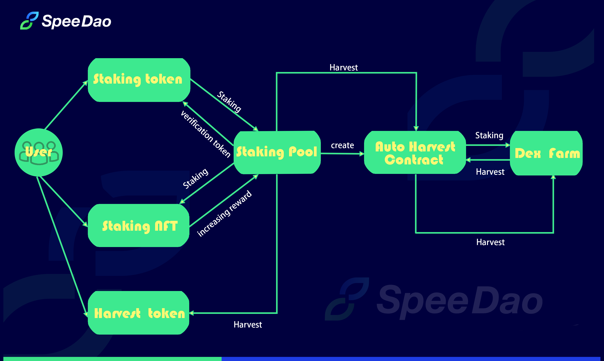

# Spee Finance

&#x20;  **Spee Finance provides a full-chain revenue aggregation protocol with streaming payment insurance features. From the perspective of the development process of DeFi, insurance is an important part but currently missing.New users who want to attempt crypto are always discouraged by hacking incidents. However, the existing multi-chain income compounding protocol doesn’t undertake the obligation proactively to insure users. At the same time, the unreasonable charging and economic model with unfriendly user experience make the world of DeFi unable to undertake the influx of new users. We want to make use of product features to change the status quo.**

.png>)

.png>)

