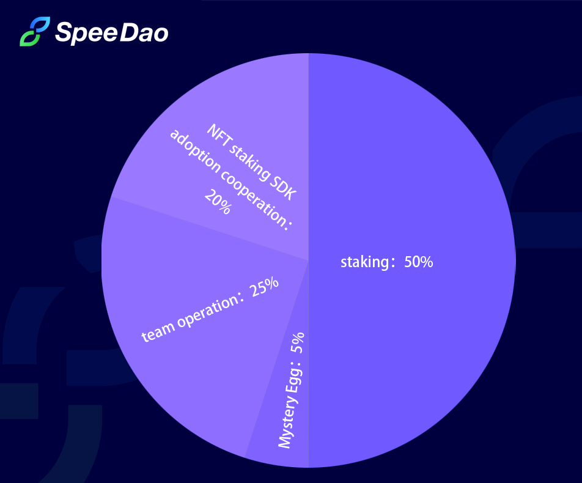

# Staking NFT Club

&#x20;   **Vitalik: "We have to be intentional, and make sure more of the right things happen".**

&#x20;   **The Staking NFT Club hopes to gather more public blockchain NFT enthusiasts to do more correct and interesting things.**

&#x20;   **Our total NFT is 10,000 copies, which will be minted on well-known public blockchains in batches. The portion of the proceeds from sales will be used to stake the project voted on by the community, and the profits that created will be returned to the community. We hope to support the development of potential projects for a long time through a good community culture，so that community members can enjoy the benefits from project development.**

**Economic Model:**

